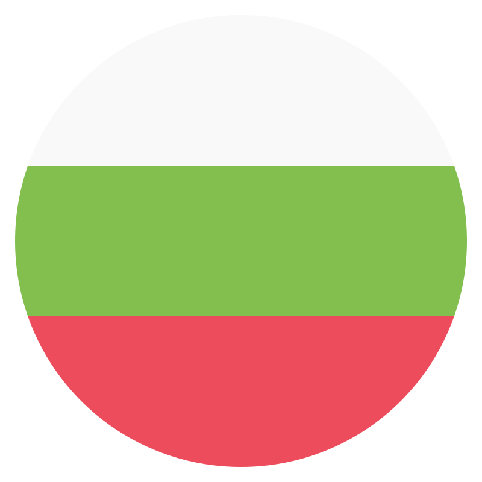

### Hey hey hey, nice to see you here 👋

---

I'm **Hristo**, a _frontend developer_ from  **Varna, Bulgaria**. I like to waste time messing with CLI tools and dotfile configs.

_ [hristo.dev](https://hristo.dev/) /  [hi@hristo.dev](mailto:hi@hristo.dev) /  [linkedIn](https://www.linkedin.com/in/hristokaramanliev/) /  [telegram](https://t.me/karamanliev)_

```ts
/*
 ___  ___  ________  ___  ________  _________  ________      ________  _______   ___      ___ 
|\  \|\  \|\   __  \|\  \|\   ____\|\___   ___\\   __  \    |\   ___ \|\  ___ \ |\  \    /  /|
\ \  \\\  \ \  \|\  \ \  \ \  \___|\|___ \  \_\ \  \|\  \   \ \  \_|\ \ \   __/|\ \  \  /  / /
 \ \   __  \ \   _  _\ \  \ \_____  \   \ \  \ \ \  \\\  \   \ \  \ \\ \ \  \_|/_\ \  \/  / / 
  \ \  \ \  \ \  \\  \\ \  \|____|\  \   \ \  \ \ \  \\\  \ __\ \  \_\\ \ \  \_|\ \ \    / /  
   \ \__\ \__\ \__\\ _\\ \__\____\_\  \   \ \__\ \ \_______\\__\ \_______\ \_______\ \__/ /   
    \|__|\|__|\|__|\|__|\|__|\_________\   \|__|  \|_______\|__|\|_______|\|_______|\|__|/    
                            \|_________|
*/

const hristo: Me = {
    currentCompany: 'Despark',
    currentPosition: 'Senior Frontend Developer',
    coding: {
        stack: ['TypeScript', 'Node', 'PHP', 'HTML', 'CSS/SASS'],
        frameworks: ['React', 'NextJS', 'Astro', 'WordPress'],
    },
    design: ['Photoshop', 'Illustrator', 'Inkscape', 'XD', 'Figma'],
    futureGoals: async (goal: string): Promise<string[]> => {
        const currentGoals = await fetchCurrentGoals() // ['learn Electron', 'contribute to OSS more', 'try more JS frameworks :D']
        const updatedGoals = [...currentGoals, goal]

        return updatedGoals
    },
}
```
